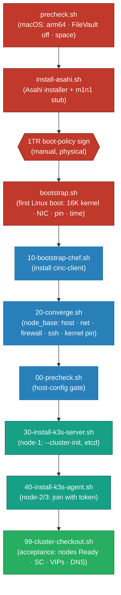
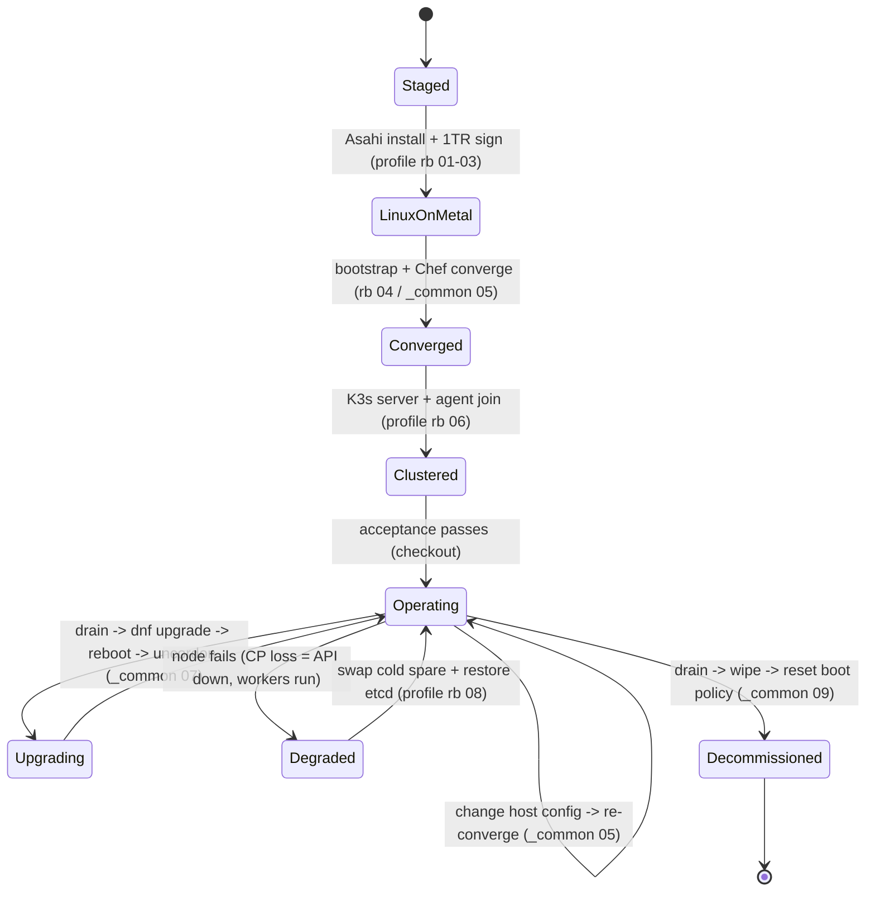

# Apple Silicon → Linux → K3s

### Production Kubernetes on bare-metal Linux on secondhand Apple Silicon Mac minis — a provisioning + day-2 operations playbook in shell and Chef.

> **Engineering Philosophy / Thesis:** The lazy way to get Linux Kubernetes onto a Mac is to run a
> Linux VM on macOS and a cluster inside it — and you pay the macOS memory tax, the hypervisor tax,
> and a dishonest failure model where one host reboot takes the whole cluster with it. The
> production answer is to **delete macOS and run Linux on the metal** — except Apple Silicon's
> secure-boot chain was built to forbid exactly that, with no PXE, no IPMI, and a memory page size
> most binaries don't expect. This repo crosses that wall honestly: the one phase the hardware
> forces to be manual is a tight, gated runbook; **everything above the first Linux boot is code** —
> idempotent host config and a pinned, scripted K3s bring-up — on a silent, ~7 W/node, N+1
> fault-tolerant cluster that costs about as much as one new machine.

<!-- START_GENERATED:docs/diagrams/src/hero.mermaid -->

<!-- END_GENERATED:docs/diagrams/src/hero.mermaid -->

---

This is written against a **primary deployment profile** — Apple Silicon Mac minis running Fedora
Asahi Remix — with a commodity-x86/PXE target as an additive extension. It is deliberately about the
**substrate**: how you provision the nodes, converge the host, bring up the cluster, and operate it
across its whole lifecycle. Application workloads run *on* it; they are not its subject.

## Table of Contents

- [Business Case](#business-case)
- [Cost Model](#cost-model)
- [Why This Approach](#why-this-approach)
- [The Welds](#the-welds)
- [Architecture at a Glance](#architecture-at-a-glance)
- [Key Architecture Decisions](#key-architecture-decisions)
- [Lifecycle, Operations & Support](#lifecycle-operations--support)
- [Repository Layout](#repository-layout)
- [Prerequisites & Dependencies](#prerequisites--dependencies)
- [Quick Start](#quick-start)
- [Design Docs](#design-docs)
- [Scope & Constraints](#scope--constraints)
- [License](#license)

---

## Business Case

> **Business accumen first. What are we solving, and why is it worth solving — in money and time.**

An edge compute footprint has a fixed job: run workloads close to where they're needed, always-on,
fault-tolerant, cheap to power, quiet enough to live on a shelf. The *avoidable* cost is **paying for
a single expensive machine that is also a single point of failure**, or paying the resource tax of a
VM cluster that hides the failure domain. The keystone friction is Apple's boot wall — but it's a
**one-time, per-node toll**, not a recurring meter.

Spend the same capital on **three secondhand M1 minis plus a cold spare** instead of one new box, and
you get genuine N+1 fault tolerance and far more aggregate compute, at ~7 W/node, for roughly the
same money — then run it for ~$23/mo.

### Financial Comparison Matrix

| Expense Class | Status Quo (1× new M4/x86 box) | Alternative (VM cluster on macOS) | **This Design (3× secondhand on the metal)** |
|---|---|---|---|
| **Initial CapEx** | ~$800–1,000 (one node) | ~$800–1,000 + lost RAM to macOS | **~$900** (3 nodes) + ~$300 spare¹ |
| **Recurring OpEx** | ~$6.5/mo power | host-OS + hypervisor tax | **~$23/mo** amortized (hw + spare + power)² |
| **MTTR (node loss)** | days (procure + stage) | host reboot kills the cluster | **~5–15 min** (cold-spare swap)³ |
| **Fault tolerance** | none — box dies, service dies | false (one host under all guests) | **N+1** — node dies, cluster survives |
| **Workload RAM/node** | full, but one node | minus 4–8 GB macOS tax | **~full** (<250 MB host footprint) |

¹ Secondhand M1 ~$300/node, new M4 base climbing to ~$900–1,000 configured ([COST-MODEL §1.1](docs/COST-MODEL.md#11-hardware-capex--the-core-comparison)).
² Amortized hw + spare + power ([COST-MODEL §1.4](docs/COST-MODEL.md#14-infra-plane-rollup-amortized)).
³ With a *pre-staged* spare ([COST-MODEL §2.2](docs/COST-MODEL.md#22-node-re-image--replacement-cost-the-asymmetric-event)).

*ROI Conclusion:* for ≈ the capital of one new box, you get a fault-tolerant 3-node cluster (24 cores
/ 24 GB) the single box cannot match — and it **pays for itself the first time a node dies and the
cluster doesn't.** The premium is a one-time ~$200 manual stand-up and the discipline of a spare.

---

## Cost Model

> Summary only — full sourced breakdown in **[docs/COST-MODEL.md](docs/COST-MODEL.md)**.

Two cost planes, kept separate because they behave differently:

| Plane | What drives it | This design's posture | Est. |
|---|---|---|---|
| **Infrastructure** | hardware CapEx (amortized) + N+1 spare + power | secondhand multi-node beats single-new on fault tolerance/dollar | **~$23/mo** amortized |
| **Operational / runtime** | provisioning toil + node replacement + steady-state ops | manual boot wall is a **fixed per-node toll**, not a meter; recovery = swap | **~$200 one-time** + sunk spare |

> **There is no AI-runtime / model-inference plane here** — no token meter, no LLM. Plane B is the
> ops analogue (provisioning toil + re-image/replacement + cluster ops). The template's AI-agent
> boilerplate was removed (see the friction log).

- **Secondhand multi-node vs one new box:** N+1 fault tolerance and 24 cores/24 GB for the price of
  one machine with none of that ([COST-MODEL §1](docs/COST-MODEL.md#1-infrastructure-plane--own-and-run-the-cluster)).
- **The wall is a one-time toll:** ~$200 to stand up the fleet, then ~$0 marginal per change
  ([COST-MODEL §2](docs/COST-MODEL.md#2-operational--runtime-plane--operate-the-platform)).
- ⚠️ **Operational cost traps:** the boot wall is a **physical** toll (stage the spare *before* you
  need it); a wipe destroys the boot authorization; an auto-upgrade can install an unbootable kernel
  (the pin blocks it); a snapshot nobody restored is not a backup. Full list:
  [COST-MODEL §3](docs/COST-MODEL.md#3-️-operational-cost-traps-read-before-deploying).

---

## Why This Approach

**Bare metal, not a VM.** Deleting macOS removes the memory and hypervisor tax and gives one honest
failure domain per node — the only reason to use this hardware at all. *(See [ADR-0001](docs/adr/0001-bare-metal-linux-over-macos-vm.md).)*

**Manual only where the hardware forces it; declarative everywhere it doesn't.** The 1TR boot-policy
gate is the sole manual primitive. Past first boot, host config is an idempotent Chef/Cinc converge
and the cluster is scripted, pinned, and acceptance-gated. *(See [ADR-0006](docs/adr/0006-chef-cinc-solo-host-config.md) · [ADR-0007](docs/adr/0007-manual-provisioning-accepted.md).)*

**Fault tolerance bought with capital, not warranty.** Secondhand multi-node + a cold spare beats one
new machine on availability-per-dollar; the spare *is* the support contract. *(See [ADR-0002](docs/adr/0002-secondhand-multi-node-over-single-new.md).)*

**Face the constraints, don't hide them.** K3s (not full Kubernetes) leaves the RAM to the work; a
single control plane (not 3-node etcd HA) keeps the resource tax low and the recovery a documented
restore; the 16K page size is a workload admission criterion, not a thing to mask behind a guest
kernel. *(See [ADR-0003](docs/adr/0003-k3s-over-full-kubernetes.md) · [ADR-0004](docs/adr/0004-single-control-plane-etcd.md) · [ADR-0006b](docs/adr/0006b-face-16k-page-size.md).)*

---

## The Welds

If you read nothing else: this repo turns a stock, locked-down Mac mini into a **fault-tolerant
Kubernetes node on bare-metal Linux** — crossing Apple's boot wall once by hand, then converging the
host and bringing up K3s entirely in code, on a silent low-power cluster backed by a cold spare. The
welds — where this departs from the default shape — are below, in primitives.

| Weld | Out of the box | What this repo does |
|---|---|---|
| **Host primitive** | macOS on the metal, or Linux in a VM (memory + hypervisor tax) | bare-metal Fedora Asahi Remix; <250 MB host footprint, one failure domain/node |
| **Provisioning primitive** | "just PXE it" (impossible) or click through by hand forever | one gated manual boot-policy step, then idempotent converge + scripted bring-up |
| **Config primitive** | snowflake hosts hand-tuned over SSH | declared `node_base` cookbook; re-converge corrects drift, zero snowflakes |
| **Orchestration primitive** | full control plane eating scarce node RAM | K3s single binary; single CP + workers; workloads survive a CP outage |
| **Redundancy primitive** | one expensive box under warranty | N+1 secondhand nodes + a pre-staged cold spare; recovery is a swap |
| **Upgrade primitive** | `dnf upgrade` installs a generic kernel and bricks the node | kernel **pinned**; generic aarch64 kernels excluded; rolling, one node at a time |
| **Page-size primitive** | assume 4 KB, crash at runtime | 16 KB is an **admission criterion** vetted before adoption |
| **Secret primitive** | join token pasted into a config file | injected at runtime, never converged or committed |

---

## Architecture at a Glance

The bring-up dependency chain, colored by automation class — **manual** (the boot wall) →
**idempotent** (host converge) → **declarative** (K3s + acceptance):

<!-- START_GENERATED:docs/diagrams/src/architecture_at_a_glance.mermaid -->

<!-- END_GENERATED:docs/diagrams/src/architecture_at_a_glance.mermaid -->

---

## Key Architecture Decisions

The load-bearing calls are documented as [Architecture Decision Records](docs/adr/README.md) — each
stating the alternatives that were genuine candidates and *why they lost*, not just the chosen answer.

| ADR | Decision | Rejected alternatives |
|---|---|---|
| [0001](docs/adr/0001-bare-metal-linux-over-macos-vm.md) | Bare-metal Linux over a VM-on-macOS cluster | Linux VM on macOS (memory + hypervisor tax) |
| [0002](docs/adr/0002-secondhand-multi-node-over-single-new.md) | Secondhand multi-node + cold spare over one new box | single new M4/x86 (no fault tolerance) |
| [0003](docs/adr/0003-k3s-over-full-kubernetes.md) | K3s over full upstream Kubernetes | kubeadm full control plane (footprint) |
| [0004](docs/adr/0004-single-control-plane-etcd.md) | Single control plane over 3-node etcd HA | embedded-etcd HA quorum (resource + complexity tax) |
| [0005](docs/adr/0005-fedora-asahi-remix-distro.md) | Fedora Asahi Remix (Server) as the host distro | generic aarch64 (won't boot); Asahi Arch (fleet fit) |
| [0006](docs/adr/0006-chef-cinc-solo-host-config.md) | Chef/Cinc local-mode for idempotent host config | bespoke shell; config server; Ansible (narrowly) |
| [0006b](docs/adr/0006b-face-16k-page-size.md) | Face the 16K page size as an admission criterion | 4K guest kernel in a VM; reactive break-fix |
| [0007](docs/adr/0007-manual-provisioning-accepted.md) | Accept the manual boot gate; engineer around it | scripting 1TR (impossible); stay on macOS |
| [0008](docs/adr/0008-mutable-host-over-immutable-ab.md) | Minimal mutable kernel-pinned host over immutable A/B | immutable A/B OS (unavailable on Apple Silicon) |

---

## Lifecycle, Operations & Support

The full lifecycle is owned here — **provision → deploy → operate → maintain → decommission** — not
just day-zero install. The operating model (monitoring, upgrade cadence, support tiers, break-fix)
lives in **[docs/OPERATIONS.md](docs/OPERATIONS.md)**.

<!-- START_GENERATED:docs/diagrams/src/lifecycle.mermaid -->

<!-- END_GENERATED:docs/diagrams/src/lifecycle.mermaid -->

| Phase | Owns | Where |
|---|---|---|
| **Day-0 Provision** | bare-metal Linux (manual gate), converged host, K3s substrate, staged spare | [OPERATIONS](docs/OPERATIONS.md#day-0--provision-stand-it-up) + [profile rb 01–06](docs/runbooks/README.md) |
| **Day-1 Deploy** | full K3s bring-up + acceptance + first off-node snapshot | [profile rb 06](docs/runbooks/profile-bare-metal-asahi/06-k3s-bringup/RUNBOOK.md) |
| **Day-2 Operate** | health, rolling upgrades, etcd+PVC backups, kernel-pin watch | [OPERATIONS](docs/OPERATIONS.md#day-2--operate-run-it-like-it-matters) |
| **Support / break-fix** | self-heal → operator (cold-spare swap) → bench/upstream | [OPERATIONS](docs/OPERATIONS.md#support-model--break-fix) |
| **Day-N Decommission** | drain, wipe, **reset Secure Enclave boot policy**, no orphans | [_common rb 09](docs/runbooks/_common/09-decommission/RUNBOOK.md) |

Each transition is a documented runbook, not a tribal-knowledge checklist. **Runbooks are split by
[deployment profile](docs/runbooks/README.md#the-deployment-profile-model)** — `bare-metal-asahi` is
written concretely, with `x86-pxe` as an additive extension that reuses `_common/` and the whole
provisioning deliverable unchanged.

---

## Repository Layout

```
apple-silicon-linux-k3s/
├── README.md                  # you are here — business case, justification, summary, links
├── LICENSE                    # MIT
│
├── docs/
│   ├── HLD.md                 # vendor-AGNOSTIC: the boot pattern, segmentation, etcd trade-off, 16K property
│   ├── LLD.md                 # vendor-SPECIFIC: M1, Asahi, K3s flags, addresses, Environment Profiles
│   ├── COST-MODEL.md          # infra plane (secondhand vs new + spare + power) + ops plane + traps
│   ├── OPERATIONS.md          # Day-0/1/2 + monitoring + support tiers + cold-spare + decommission
│   ├── adr/                   # 9 MADR records — alternatives considered + why they lost
│   ├── diagrams/src/          # Mermaid sources (single source of truth, injected into docs)
│   └── runbooks/              # split by deployment profile:
│       ├── _common/                    #   lifecycle ROLES: host-converge · rolling-upgrade · decommission
│       ├── profile-bare-metal-asahi/   #   PRIMARY: rack · macos-prep · asahi-install · bootstrap · k3s · cold-spare
│       └── profile-x86-pxe/            #   EXTENSION: unattended PXE (the wall is gone)
│
├── provisioning/              # THE artifact: bring-up scripts + the Chef/Cinc node_base cookbook
│   ├── scripts/{staging,cluster,operations}/   # precheck · asahi · bootstrap · converge · k3s · checkout
│   └── chef/                  # solo.rb · cookbooks/node_base · nodes/node-{1,2,3}.json
│
└── scripts/                   # validate.sh + preflight.sh + gates/ (provisioning lint) + build_docs.py
```

## Prerequisites & Dependencies

Everything the Quick Start needs. Versions are pinned to this repo's own source of truth: the K3s pin
is `provisioning/scripts/cluster/30-install-k3s-server.sh` (`v1.34.x+k3s1`); the rest are the tools
the scripts and `validate.sh` actually invoke.

| Tool | Version | Install | Purpose |
|---|---|---|---|
| **macOS** (on the target Mac) | Sonoma+ with 1TR | preinstalled | Hosts the boot-policy signing; staging precheck runs here |
| **Asahi installer** | current | fetched by `install-asahi.sh` from the Asahi homepage | Installs Fedora Asahi Remix + the `m1n1` boot stub |
| **Fedora Asahi Remix** | Server (kernel-16k) | via the installer | The bare-metal host OS |
| **cinc-client** (Chef) | ≥ 17 | auto-installed by `10-bootstrap-chef.sh` | Idempotent host converge (`node_base` cookbook) |
| **K3s** | `v1.34.x+k3s1` | `30/40-install-k3s-*.sh` (upstream `get.k3s.io`) | The cluster substrate (pinned) |
| **kubectl** | matches K3s | `brew install kubectl` · ships with K3s | Drive the cluster / run acceptance |
| **Python 3** | ≥ 3.8 | preinstalled on macOS, or `brew install python` | Runs `scripts/build_docs.py` + `validate.sh` doc-sync gate |
| **Ruby** | ≥ 2.6 | preinstalled on macOS / Fedora | `ruby -c` cookbook syntax check in the validate gate |
| **shellcheck** | any | `brew install shellcheck` | Deep shell lint in the validate gate (optional; `bash -n` always runs) |
| **Git** | any | `brew install git` · [git-scm.com/downloads](https://git-scm.com/downloads) | Version control |

> **Secrets at runtime:** the K3s join token is read from the environment at agent-join time and
> sealed into a password manager — it is **never** committed, converged into a node JSON, or written
> to a recipe ([ADR-0006](docs/adr/0006-chef-cinc-solo-host-config.md)). All addresses (`10.0.32.0/27`,
> `node-1/2/3`) are placeholders — adapt before running.

## Quick Start

> Full detail in [`docs/runbooks/`](docs/runbooks/README.md). Placeholders (`REPLACE_*`,
> `10.0.32.0/27`, `node-1/2/3`) must be adapted to your environment.

```bash
# 1. Bare metal (per node, manual — physical presence at the boot wall)
bash provisioning/scripts/staging/precheck.sh            # in macOS: arm64? FileVault off? space?
sudo bash provisioning/scripts/staging/install-asahi.sh  # guided Asahi install → Server, shrink macOS to ~80 GB
# power off → hold power → pick Linux → authorize the boot policy with the admin password (1TR)
sudo bash provisioning/scripts/staging/bootstrap.sh      # first Linux boot: 16K kernel, NIC, kernel pin, time

# 2. Host converge + K3s (per node, idempotent / scripted)
sudo bash provisioning/scripts/cluster/10-bootstrap-chef.sh
sudo bash provisioning/scripts/cluster/20-converge.sh    # node_base: net · firewall · ssh · kernel pin
sudo bash provisioning/scripts/cluster/30-install-k3s-server.sh    # node-1 (control plane)
K3S_TOKEN=REPLACE NODE_IP=10.0.32.3 NODE_NAME=node-2 \
  sudo -E bash provisioning/scripts/cluster/40-install-k3s-agent.sh  # workers

# 3. Verify + keep docs in sync
bash provisioning/scripts/cluster/99-cluster-checkout.sh # acceptance (from the operator machine)
scripts/validate.sh                                      # reproduce the CI gate (lint + doc-sync + secret scan)
python3 scripts/build_docs.py                            # re-inject diagrams after editing a .mermaid source
```

## Design Docs

- **[High-Level Design](docs/HLD.md)** — vendor-agnostic: the secure-boot pattern, segmentation, the
  etcd HA trade-off, the 16K-page property, lifecycle, risk register.
- **[Low-Level Design](docs/LLD.md)** — vendor-specific: M1 BOM, APFS partitioning, the Asahi boot
  chain, K3s install flags, addresses, failure modes, and the Environment Profiles.
- **[Cost Model](docs/COST-MODEL.md)** — infrastructure plane (secondhand vs new + spare + power) +
  operational plane (provisioning toil + replacement) + the operational cost traps.
- **[Operations & Support](docs/OPERATIONS.md)** — Day-0/1/2, monitoring, rolling upgrades, backups,
  support tiers, cold-spare replacement, clean decommission.
- **[Architecture Decision Records](docs/adr/README.md)** — MADR format, each with the alternatives
  genuinely considered and why they were rejected.

## Scope & Constraints

- **In scope:** the substrate — provisioning bare-metal Fedora Asahi Remix on Apple Silicon, the
  idempotent host converge, scripted K3s bring-up, segmentation + default-deny, etcd/PVC backups, the
  full lifecycle through clean decommission; `bare-metal-asahi` primary profile + `x86-pxe` extension.
- **Out of scope (intentionally):** application workload design; automating the boot-policy gate
  (hardware-forbidden); a hot-failover HA control plane at this node count; an immutable A/B host OS.
- **Known constraints / accepted risks:** initial provisioning is **manual by mandate** (no PXE/IPMI);
  the host is mutable (no A/B rollback — kernel pin + cold spare mitigate); a control-plane loss is an
  API outage until restore (workers keep serving); 16K-page workload compatibility is an admission
  criterion; secondhand hardware has no warranty (the spare is the support contract). See the
  [HLD risk register](docs/HLD.md#13-risks--open-questions).

## License

MIT — see [LICENSE](LICENSE).
