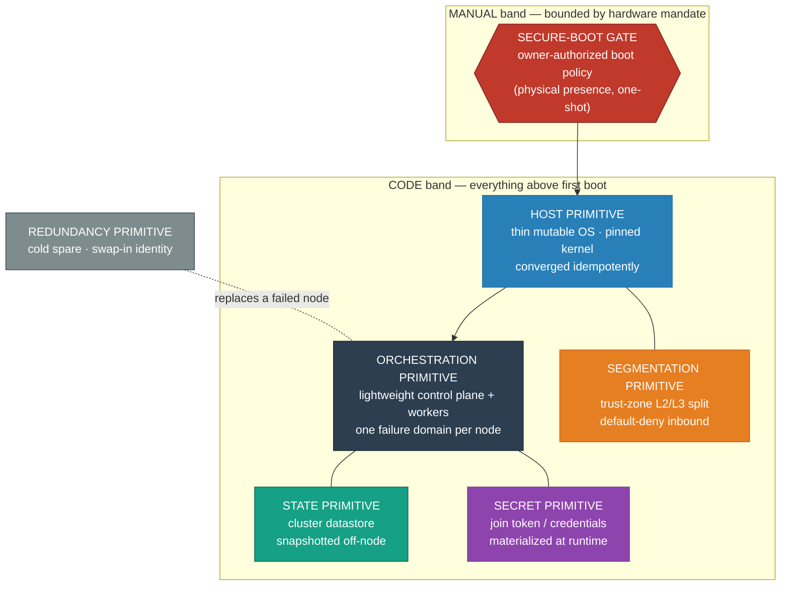
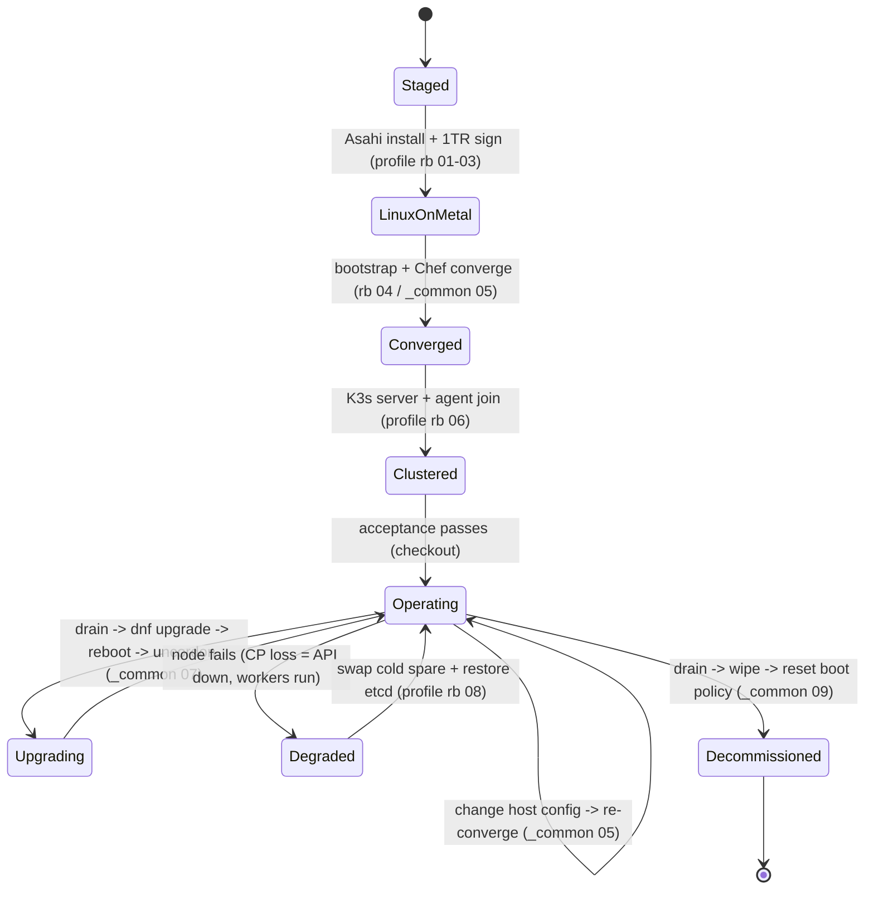

# Apple Silicon → Linux → K3s — High-Level Design

> Vendor- and solution-**agnostic**. This document is about *controls, properties, and patterns* —
> the security boundary, the segmentation model, the redundancy posture, the lifecycle. Products,
> versions, and addresses live in the [LLD](LLD.md).

<!-- START_GENERATED:docs/diagrams/src/hld_overview.mermaid -->

<!-- END_GENERATED:docs/diagrams/src/hld_overview.mermaid -->

The picture above is the whole argument in primitives. There is exactly **one manual gate** — the
secure-boot authorization the hardware mandates — and a hard line after it past which the platform is
all code: a thin converged host, a lightweight orchestrator, externalized state, runtime secrets, and
trust-zone segmentation, with a cold spare standing by. Everything below explains why each primitive
is shaped the way it is, and what we deliberately refused to do.

## Contents

1. [Purpose & Scope](#1-purpose--scope)
2. [The Workload & the Keystone Constraint](#2-the-workload--the-keystone-constraint)
3. [Goals & Non-Goals](#3-goals--non-goals)
4. [Design Principles](#4-design-principles)
5. [The Secure-Boot Path as a Pattern](#5-the-secure-boot-path-as-a-pattern)
6. [Host vs. Orchestration: the Automation Boundary](#6-host-vs-orchestration-the-automation-boundary)
7. [Cluster Shape & the etcd HA Trade-Off](#7-cluster-shape--the-etcd-ha-trade-off)
8. [Segmentation & Default-Deny](#8-segmentation--default-deny)
9. [The 16K-Page Constraint as an Architectural Property](#9-the-16k-page-constraint-as-an-architectural-property)
10. [State, Secrets & Storage](#10-state-secrets--storage)
11. [Redundancy & the Cold-Spare Posture](#11-redundancy--the-cold-spare-posture)
12. [Lifecycle](#12-lifecycle)
13. [Risks & Open Questions](#13-risks--open-questions)

---

## 1. Purpose & Scope

This design defines an **edge compute platform** built in two stacked layers:

1. **Bare-metal Linux on a fleet of Apple Silicon nodes** — no host OS underneath, no hypervisor, no
   virtual machine. Linux *is* the operating system on the metal.
2. **A production-shaped, lightweight Kubernetes cluster running directly on that bare metal** —
   L2 load-balancing, replicated storage, and acceptance-gated bring-up.

The headline is the unlikeliness: a real Kubernetes cluster on consumer hardware whose firmware was
built to *prevent* exactly this, with the two hostile constraints — a locked secure-boot chain and a
non-standard memory page size — handled head-on rather than hidden behind a virtual machine.

## 2. The Workload & the Keystone Constraint

The workload is an **always-on edge cluster**: a handful of nodes, low power, silent, surviving a
single hardware failure without downtime, running container workloads close to where they are needed.

The keystone constraint that bends every later decision:

> **The hardware's secure-boot chain forbids unattended provisioning.** There is no network boot, no
> lights-out management, no scriptable firmware. Authorizing a third-party OS requires a
> physically-present, owner-authenticated action — once per machine. No script can perform it.

Everything in this design is a consequence of accepting that gate honestly: minimize the manual
phase to a tight runbook, draw a hard boundary after first boot, and make every step above it code.

## 3. Goals & Non-Goals

**Goals**
- **G1** — Linux on the metal: no host-OS tax, one failure domain per physical node.
- **G2** — Workloads survive a single worker loss; control-plane loss is degraded-but-recoverable.
- **G3** — Everything above the manual boot gate is idempotent or declarative — zero snowflakes.
- **G4** — The platform fits a tiny power/noise/CapEx envelope and tolerates secondhand hardware.
- **G5** — A failed node is *swapped*, not field-repaired; recovery is on a minutes schedule.

**Non-Goals**
- Automating the firmware/boot-policy gate (hardware-forbidden; see §5).
- An immutable A/B host OS (the platform can't support it — see §6).
- A hot-failover HA control plane at this node count (see §7).
- Application-level workload design — this repo builds and operates the *substrate*.

## 4. Design Principles

1. **Manual only where the hardware forces it; declarative everywhere it doesn't.** The boot gate is
   the sole manual primitive. Past it, host config is idempotent and cluster state is declared.
2. **Speak in primitives.** Host, orchestration, state, secret, segmentation, redundancy — each is a
   primitive with one job and a clear relationship to the others.
3. **The host is thin and disposable.** Minimal mutable OS, pinned kernel, no precious state. The
   node is cattle; the cluster is the herd.
4. **Secrets materialize at runtime.** No join token, credential, or key is ever converged into a
   recipe, an attribute file, or git.
5. **Redundancy bought with capital saved, not warranty paid for.** Fault tolerance comes from N+1
   spare nodes, not from a single expensive machine under support.

## 5. The Secure-Boot Path as a Pattern

Stripped of the vendor, the boot chain is a **chain of trust anchored in immutable on-die firmware**
that will only hand control to a stage it can verify, and whose boot *policy* can only be changed by
the hardware owner, proven by physical presence. To run a third-party kernel, the owner authorizes a
locally-signed boot policy for a dedicated partition — a one-shot, owner-only act.

| Provisioning mechanism | Commodity server | This platform |
|---|---|---|
| Network boot (PXE/netboot) | native in firmware | **absent** — no pre-OS network stack |
| Firmware boot menu | tap a key, pick a device | **absent** — no firmware setup screen |
| Lights-out (remote power/console) | dedicated mgmt path | **absent** — solved out-of-band (external KVM + switched PDU) |
| Boot-policy change | scriptable / toggle | **owner-authenticated, physical, one-shot** |

**The architectural verdict (load-bearing for the whole design):** initial OS authorization is
manual *by mandate*, not by laziness. The engineering response is not to fight it but to (a) shrink
the manual phase to a tight, gated runbook, (b) restore remote operability *out of band* with an
external KVM and a switched power unit, and (c) make the failure-recovery story a **node swap**, not
a remote reinstall — because a clean wipe destroys the local boot authorization and re-triggers the
manual gate. *(Concrete mechanism in [LLD §3](LLD.md#3-the-boot-sequence-components); decision in
[ADR-0007](adr/0007-manual-provisioning-accepted.md).)*

## 6. Host vs. Orchestration: the Automation Boundary

The platform draws a hard line between two configuration regimes:

> **The host OS is provisioned imperatively** (a manual install, then a scripted idempotent
> converge). **All workload and cluster state is declarative**, reconciled at the orchestration
> layer. Drift is corrected by re-converging the host or re-reconciling the cluster — never by
> re-installing the machine.

We evaluated and **rejected** an immutable, A/B-swapping host OS — the modern default — because the
platform cannot support its core mechanics: there is no standard firmware to alternate boot slots,
generic immutable images lack the hardware-specific boot stub and device trees and crash on boot, and
the headline benefit (remote wipe-and-reprovision from a control plane) is *exactly* what the boot
gate forbids. So the host is a **minimal, mutable install pinned at the kernel** — the one upgrade
that can brick it — and treated as ephemeral cattle. *(See [ADR-0001](adr/0001-bare-metal-linux-over-macos-vm.md)
and [ADR-0008](adr/0008-mutable-host-over-immutable-ab.md).)*

## 7. Cluster Shape & the etcd HA Trade-Off

The cluster is **one control-plane-plus-worker node and two pure workers**, all on one L2 segment,
with a fourth identical node on the shelf as a cold spare.

The load-bearing decision here is **declining a hot-failover HA control plane.** A lightweight
orchestrator supports an HA datastore (an odd number of voting members with embedded consensus), and
the reflex is to run three. At this node count we reject it: three voting members on three total
nodes means the control plane competes with the very workloads it exists to schedule, and the
operational complexity of quorum management buys little. The honest trade:

> Lose the control-plane node and the cluster API is **down until restored** — but **workloads keep
> running on the workers the entire time**, because the node agents do not need the API server to
> keep existing pods alive. Control-plane recovery is a *documented procedure* (restore the
> datastore snapshot onto the spare), not a hot failover.

This is a deliberate availability/complexity trade, revisited if the cluster grows past the point
where the spare-swap RTO is unacceptable. *(See [ADR-0004](adr/0004-single-control-plane-etcd.md).)*

## 8. Segmentation & Default-Deny

The node carries all cluster control + data traffic on a primary trust zone, with load-balancer
announcements scoped to separate zones. The segmentation primitive is **trust-zone separation with a
default-deny inbound posture on every node** — the host firewall opens only the specific cluster
ports and nothing else, and the telemetry receiver zone is reachable from nodes but denied from user
planes. Segmentation is a *control*, expressed agnostically here; the concrete VLAN IDs, addresses,
and port list are [LLD §5](LLD.md#5-network-architecture).

## 9. The 16K-Page Constraint as an Architectural Property

This hardware maps memory in **larger pages than the commodity default**. It is not a bug to paper
over — it is a *property of the platform* the design must respect:

- The host kernel requires the larger page size; the orchestrator, container runtime, and node agent
  handle it transparently.
- The risk lives in **workloads**: memory allocators and embedded databases that hardcode the smaller
  page size can crash on load or refuse to map their files.

The platform rule that falls out of this: **page-size compatibility is an admission criterion.** An
image that faults on memory-mapping here is the defect — vet it on the real page size before
adoption, file upstream, or pick another. We face the constraint directly rather than masking it
behind a guest kernel in a VM (which would also forfeit G1). *(Failure modes + fixes in
[LLD §4](LLD.md#4-the-16k-page-kernel--workload-gotchas); decision in
[ADR-0006b](adr/0006b-face-16k-page-size.md).)*

## 10. State, Secrets & Storage

- **Cluster state** lives in the embedded datastore on the control-plane node and is **snapshotted
  off-node** on a schedule — the snapshot, not the node, is the recovery truth (RPO/RTO intent in
  [OPERATIONS](OPERATIONS.md)).
- **Workload storage** is **replicated across nodes from day one**, so a single node loss never takes
  a volume with it.
- **Secrets** (the cluster join token, credentials) are **injected at runtime** from an operator's
  secret store and never persisted into host config or git. The repo is safe to publish as-is.

## 11. Redundancy & the Cold-Spare Posture

Because remote reprovisioning is forbidden (§5), the redundancy primitive is a **pre-staged cold
spare**, not rapid in-place recovery. On a node failure: the failed unit is pulled for bench
diagnostics; the spare is cabled, assigned the failed node's static identity, converged, and joined.
Capital saved by buying secondhand hardware is reinvested directly into this spare — fault tolerance
**within the same budget** as a single new machine. *(Economics in [COST-MODEL](COST-MODEL.md);
decision in [ADR-0002](adr/0002-secondhand-multi-node-over-single-new.md).)*

## 12. Lifecycle

Full lifecycle is a first-class concern, owned in [OPERATIONS.md](OPERATIONS.md) and the
[runbooks](runbooks/README.md). As a state machine:

<!-- START_GENERATED:docs/diagrams/src/lifecycle.mermaid -->

<!-- END_GENERATED:docs/diagrams/src/lifecycle.mermaid -->

Stage → Linux-on-metal → converge → cluster → operate → upgrade/degrade → decommission. The only
backward edge that needs human presence is **Degraded → Operating via cold-spare swap** (the boot
gate again) and **Decommission** (boot-policy reset). Everything else is code.

## 13. Risks & Open Questions

| # | Risk / Question | Severity | Status | Mitigation |
|---|---|---|---|---|
| R1 | Control-plane loss = API outage until restore | High | Accepted | Workers keep serving; restore datastore snapshot onto the cold spare ([ADR-0004](adr/0004-single-control-plane-etcd.md)) |
| R2 | Host OS is mutable (no A/B rollback) | Medium | Accepted | Host state minimized; drift corrected by re-converge; kernel pinned; cold spare on shelf ([ADR-0008](adr/0008-mutable-host-over-immutable-ab.md)) |
| R3 | Larger-page-size workload incompatibility | Medium | Mitigated | Page-size vetting is an admission criterion; allocators/DBs validated before deploy ([ADR-0006b](adr/0006b-face-16k-page-size.md)) |
| R4 | No remote console during a boot failure | High | Mitigated | Out-of-band KVM + switched PDU restore remote power/console (companion OOB project) |
| R5 | An automatic upgrade installs a generic, unbootable kernel | High | Mitigated | The converge **pins the kernel**, excluding generic kernels from upgrades |
| R6 | No official warranty on secondhand hardware | Medium | Accepted | N+1 cold spare; capital saved funds the spare ([ADR-0002](adr/0002-secondhand-multi-node-over-single-new.md)) |
| R7 | Manual gate doesn't scale past a small fleet | Medium | Accepted | Scope is small-scale edge; manual phase is a tight runbook ([ADR-0007](adr/0007-manual-provisioning-accepted.md)) |
