# Apple Silicon → Linux → K3s — Low-Level Design

> Vendor- and solution-**specific**. This is where the products, versions, addresses, partition
> tables, CLI flags, and concrete resource definitions live — everything the [HLD](HLD.md)
> deliberately abstracted. All addresses, hostnames, and tokens are **sanitized placeholders**
> (private/example ranges, `REPLACE_*`); adapt before running.

```mermaid
%% LLD TOPOLOGY — vendor-SPECIFIC. Named products, concrete (sanitized) addresses, 3-node shape.
flowchart TB
    subgraph Trunk ["Single trunked 1GbE per node — 3 VLANs"]
        direction LR
        V32["<b>NODES</b> VLAN 32 · 10.0.32.0/27<br/>K3s API · etcd · kubelet · Flannel · pod egress"]
        V208["<b>SERVICES</b> VLAN 208 · 10.0.208.0/28<br/>MetalLB L2 — north-south VIPs"]
        V224["<b>TELEMETRY</b> VLAN 224 · 10.0.224.0/29<br/>MetalLB L2 — receiver-only VIPs"]
    end

    subgraph Cluster ["3-node K3s · Fedora Asahi Remix (kernel-16k) on M1 Mac mini"]
        K1["<b>node-1</b> · 10.0.32.2<br/>control-plane + worker<br/>embedded etcd (--cluster-init)<br/>Longhorn · MetalLB"]
        K2["<b>node-2</b> · 10.0.32.3<br/>worker · Longhorn replica"]
        K3["<b>node-3</b> · 10.0.32.4<br/>worker · Longhorn replica"]
        KS["<b>node-spare</b><br/>cold spare (shelf)<br/>pre-staged, swap-in identity"]
    end

    OOB["PiKVM + switched PDU<br/>(out-of-band console/power)"]

    V32 --- K1 & K2 & K3
    V208 -. "tagged sub-if (announce only)" .- K1 & K2 & K3
    V224 -. "tagged sub-if (announce only)" .- K1 & K2 & K3
    KS -. "assume node-1 identity on failure" .- K1
    OOB -. "HDMI + USB + power" .- K1 & K2 & K3

    style K1 fill:#2c3e50,color:#fff,stroke:#1a252f
    style K2 fill:#27ae60,color:#fff,stroke:#1e8449
    style K3 fill:#27ae60,color:#fff,stroke:#1e8449
    style KS fill:#7f8c8d,color:#fff,stroke:#34495e
    style OOB fill:#34495e,color:#fff,stroke:#1a252f
    style V32 fill:#2980b9,color:#fff,stroke:#1f6fa5
    style V208 fill:#8e44ad,color:#fff,stroke:#713f8f
    style V224 fill:#e67e22,color:#fff,stroke:#b9651a
```

<!-- START_GENERATED:docs/diagrams/src/lld_topology.mermaid -->

<!-- END_GENERATED:docs/diagrams/src/lld_topology.mermaid -->

## Contents

1. [Hardware Bill of Materials](#1-hardware-bill-of-materials)
2. [Disk Partitioning (APFS Containers)](#2-disk-partitioning-apfs-containers)
3. [The Boot Sequence Components](#3-the-boot-sequence-components)
4. [The 16K-Page Kernel & Workload Gotchas](#4-the-16k-page-kernel--workload-gotchas)
5. [Network Architecture](#5-network-architecture)
6. [Host Configuration (Chef/Cinc node_base)](#6-host-configuration-chefcinc-node_base)
7. [Node Roles & Cluster Addressing](#7-node-roles--cluster-addressing)
8. [K3s Install Parameters & Version Pin](#8-k3s-install-parameters--version-pin)
9. [State, Snapshots & Restore — Concrete Commands](#9-state-snapshots--restore--concrete-commands)
10. [Failure Modes & Recovery](#10-failure-modes--recovery)
11. [Environment Profiles](#11-environment-profiles)

---

## 1. Hardware Bill of Materials

All active nodes match one spec for uniform converge and a single spares pool.

| Component | Target spec | Operational rationale |
|---|---|---|
| Compute | Apple M1 (8 cores: 4P + 4E) | high perf/watt; ~6–10 W idle |
| Memory | 8 GB or 16 GB unified (LPDDR4X) | ~68 GB/s bandwidth; host footprint <250 MB leaves the rest for workloads |
| Storage | 256 GB / 512 GB onboard PCIe SSD | ~2.5 GB/s; **soldered, non-replaceable** (informs the swap-not-repair posture) |
| Keyboard | wired USB-A | **required** — Bluetooth keyboards don't work in the recovery (1TR) screen |
| Display | HDMI 2.0 | direct console for install + recovery |
| Network | RJ-45 Gigabit | shielded Cat6 to the access switch |
| Power control | switched PDU | remote hard power-cycle on an OS lockup |
| OOB | external IP-KVM (PiKVM) | remote console/power past the no-IPMI wall |

## 2. Disk Partitioning (APFS Containers)

The Asahi installer shrinks the stock macOS container to make room for Linux. macOS **must remain**
— it houses the boot-policy security material. Example for a 256 GB SSD:

```
+-----------------------------------------------------------------------+
|                     Internal SSD (256 GB total)                       |
+-----------------------------+-----------------------------------------+
| macOS System (~80 GB)       | Fedora Asahi Linux (remainder)          |
|  recovery / iSCPreboot/1TR  |  ESP (FAT32, ~500 MB): m1n1+U-Boot+GRUB |
|  LocalPolicy (Image4 sigs)  |  Linux root (ext4/btrfs, ~175 GB)       |
+-----------------------------+-----------------------------------------+
```

| Slice | Type | Format | Size | Purpose |
|---|---|---|---|---|
| `disk0s1` | Apple Boot | APFS | ~2.5 GB | recovery / core OS utilities |
| `disk0s2` | System container | APFS | ~80 GB | **macOS** — holds `LocalPolicy` keys. **Do not delete.** |
| `disk0s3` | ESP | FAT32 | 500 MB | compiled `m1n1` stub, U-Boot, GRUB |
| `disk0s4` | Linux root | ext4/btrfs | remainder | Fedora Asahi Remix |

## 3. The Boot Sequence Components

Apple Silicon has no standard UEFI; Asahi chains custom loaders to translate the hardware:

1. **BootROM** (on-die, immutable) → loads the Low-Level Bootloader.
2. **LLB** → evaluates the `LocalPolicy` (Apple **Image4** ASN.1/DER container) signed locally by the
   **Secure Enclave Processor (SEP)** with the **Owner Identity Key (OIK)**.
3. **m1n1** → open-source bootloader stub + lightweight hypervisor; initializes registers and
   translates Apple's device trees into a standard form Linux understands.
4. **U-Boot** → implements standard UEFI services, brings up USB + framebuffer console.
5. **GRUB** → reads `grub.cfg`, presents the kernel menu.
6. **`kernel-16k`** → the Fedora Asahi Remix kernel, built with the 16 KB page size + Apple drivers.

To load step 3, the Linux container's boot policy must be set to **Permissive Security**, authorized
from **One True Recovery (1TR)** behind a physical power-button hold and the admin password. Because
containers are independent, the macOS container stays at **Full Security** — Linux's policy does not
lower it.

## 4. The 16K-Page Kernel & Workload Gotchas

### What a "page" is, and why this matters

A **memory page** is the smallest fixed-size block the CPU's memory-management unit (MMU) and the
kernel use to hand out, map, and protect RAM. The kernel never tracks memory byte-by-byte; it tracks
it one page at a time. The page size is therefore the fundamental allocation granularity of the whole
system — every `mmap`, every file mapped into memory, every memory-protection boundary is rounded to
a whole number of pages.

For ~30 years the de-facto standard on commodity x86_64 has been a **4 KB** page. That number is so
universal that a lot of software stopped treating it as a variable and simply hardcoded `4096`
somewhere — in an allocator's internal math, in a database's on-disk file layout, in an assumption
about how big an `mmap` region will round up to.

```
Commodity x86_64 page:  [ 4 KB ]
Apple Silicon page:     [     16 KB     ]   ← 4× larger allocation unit
```

**Apple Silicon uses a 16 KB page** (4× larger). This is not a tunable on these chips — the hardware
MMU and the Asahi/Fedora Asahi kernel require it. So any binary that *assumed* 4 KB is now wrong by a
factor of four, and "wrong about a fundamental MMU constant" tends to surface as a hard crash
(`SIGSEGV`/`SIGBUS`) or a refused syscall (`EINVAL`), not a graceful warning.

### Who is and isn't affected

The good news: the **platform layer is already 16K-clean**. The host kernel, K3s, containerd, and the
kubelet all handle 16K pages transparently (K3s on aarch64 supports it since v1.25.10). Nothing in the
cluster substrate needs special handling.

The risk is entirely in **workloads** — the application containers you schedule on top. Two families
are the usual offenders, because both touch the page size directly:

- **Memory allocators** (`jemalloc`, `tcmalloc`) compute their internal slab/arena sizes from the page
  size; if that was frozen at 4 KB at build time, they miscalculate against a 16 KB MMU and fault on
  load.
- **Embedded databases** (RocksDB, LMDB, LevelDB) memory-map their data files, and the file's layout
  is page-aligned. A file *written* on a 4 KB host can be unreadable (`EINVAL`/`SIGBUS`) when mapped
  on a 16 KB host, even though it's the same database engine.

The table below is the operational cheat-sheet — what breaks, how it shows up, and the fix. (The
architectural decision to treat this as a workload *admission criterion* rather than mask it behind a
4 KB VM layer is [ADR-0006b](adr/0006b-face-16k-page-size.md).)

| Class | Failure | Fix |
|---|---|---|
| Allocators (`jemalloc`/`tcmalloc`) | `SIGSEGV` on load when built for 4 KB | rebuild with `--with-lg-page=14` (2¹⁴ = 16384) |
| Embedded DBs (RocksDB/LMDB/LevelDB) | `EINVAL`/`SIGBUS` if the file was made on a 4 KB host | dump/restore or re-index on a 16K host; align to the host MMU |
| Containers | binaries with baked-in 4 KB assumptions fault inside the pod | build/test images on a 16K target before adoption |

**Acceptance check:** `getconf PAGE_SIZE` must return `16384` (see `provisioning/scripts/operations/checkout.sh`).

## 5. Network Architecture

A single trunked 1GbE link per node carries three VLANs. NODES is the untagged primary; SERVICES and
TELEMETRY are tagged sub-interfaces used **announce-only** by the L2 load balancer (MetalLB).

| VLAN | Name | Subnet (placeholder) | Carries |
|---|---|---|---|
| 32 | NODES | `10.0.32.0/27` | K3s API · etcd · kubelet · Flannel VXLAN · pod egress |
| 208 | SERVICES | `10.0.208.0/28` | MetalLB L2 north-south VIPs |
| 224 | TELEMETRY | `10.0.224.0/29` | MetalLB L2 receiver-only VIPs (node→receiver; denied from user planes) |

- **CNI:** Flannel (VXLAN); source/dest are the NODES IPs.
- **Pod CIDR** `10.42.0.0/16` · **Service CIDR** `10.43.0.0/16` · **Cluster DNS** `10.43.0.10` (K3s defaults).
- **Router SVI (NODES gateway):** `10.0.32.1`. **Default route must be NODES only** — the tagged
  sub-interfaces must never leak a default route (the host-config precheck enforces this).
- **Interface naming:** Asahi onboard NIC is typically `end0`; verify with `nmcli device status`.
- **Wireless is masked** on every node (`nmcli radio wifi off` + mask `wpa_supplicant`).

## 6. Host Configuration (Chef/Cinc node_base)

Host config is an **idempotent local-mode converge** — Cinc (open-source Chef) with no Chef server.
`provisioning/scripts/cluster/20-converge.sh` picks the node's attributes by hostname:

```bash
cinc-client --local-mode \
  --config   provisioning/chef/solo.rb \
  --json-attributes provisioning/chef/nodes/node-1.json \
  --chef-license accept-silent
```

The `node_base` cookbook ([`provisioning/chef/cookbooks/node_base`](../provisioning/chef/cookbooks/node_base))
declares, all idempotently:

- **Hostname** + a **static NetworkManager connection** on the NODES VLAN (re-applied only if the
  declared address isn't already live).
- **Wireless off** + `wpa_supplicant` masked.
- **Default-deny firewalld** (`public` zone target = `DROP`) opening only:
  `22/tcp` (SSH), `6443/tcp` (API), `2379-2380/tcp` (etcd client/peer), `10250/tcp` (kubelet),
  `8472/udp` (Flannel VXLAN), `51820/udp` (Flannel WireGuard if enabled).
- **Key-only SSH** (`PasswordAuthentication no`, `PermitRootLogin prohibit-password`).
- **Kernel pin** — `exclude=kernel kernel-core kernel-modules` in `/etc/dnf/dnf.conf`, so an upgrade
  can never install a generic aarch64 kernel that lacks the Apple device trees and bricks boot.
- **Time sync** via chrony.

Per-node attributes are the only thing that varies:

```json
{ "run_list": ["recipe[node_base]"],
  "node_base": { "hostname": "node-1", "net": { "address": "10.0.32.2/27" } } }
```

## 7. Node Roles & Cluster Addressing

| Node | Role | NODES IP (`--node-ip`) | Notes |
|---|---|---|---|
| `node-1` | control-plane + worker | `10.0.32.2/27` | embedded etcd (`--cluster-init`); Longhorn + MetalLB |
| `node-2` | worker | `10.0.32.3/27` | Longhorn replica |
| `node-3` | worker | `10.0.32.4/27` | Longhorn replica |
| `node-spare` | cold spare | — | shelf; assumes a failed node's identity on swap |

## 8. K3s Install Parameters & Version Pin

**Install method:** the upstream `https://get.k3s.io` script, pinned. No distro-packaged K3s.
**Version pin:** `v1.34.x+k3s1` (confirm the exact patch at install; commit to `k3s-version.txt`).
Rationale: the 1.34 line has the longest active-support runway; K3s supports 16K aarch64 pages since
v1.25.10 with no special build flags.

**Control plane — `node-1`** (`provisioning/scripts/cluster/30-install-k3s-server.sh`):

```bash
curl -sfL https://get.k3s.io | INSTALL_K3S_VERSION=v1.34.x+k3s1 \
  INSTALL_K3S_EXEC="server --cluster-init --disable=traefik --disable=servicelb \
    --node-ip=10.0.32.2 --node-name=node-1 --tls-san=10.0.32.2 --etcd-snapshot-retention=30" sh -
```

**Workers — `node-2`/`node-3`** (`40-install-k3s-agent.sh`; token from the environment, never
hardcoded):

```bash
K3S_TOKEN=REPLACE_FROM_SECRET_STORE NODE_IP=10.0.32.3 NODE_NAME=node-2 \
  sudo -E bash provisioning/scripts/cluster/40-install-k3s-agent.sh
```

`traefik` and `servicelb` are disabled so ingress/LB are managed deliberately (MetalLB L2 on the
SERVICES/TELEMETRY sub-interfaces). The join token is read from `node-1`
(`/var/lib/rancher/k3s/server/node-token`) and sealed into the operator's password manager.

## 9. State, Snapshots & Restore — Concrete Commands

- **Automatic snapshots:** K3s writes daily etcd snapshots to
  `/var/lib/rancher/k3s/server/db/snapshots/` (`--etcd-snapshot-retention=30`).
- **Off-node replication** (cron on the control plane): copy snapshots to an object store, e.g.
  `aws s3 sync /var/lib/rancher/k3s/server/db/snapshots/ object-store://REPLACE_BUCKET/etcd/`.
- **Restore drill** (rebuild the control plane onto the spare):

```bash
curl -sfL https://get.k3s.io | INSTALL_K3S_VERSION=v1.34.x+k3s1 \
  INSTALL_K3S_EXEC="server --cluster-init --cluster-reset \
    --cluster-reset-restore-path=/path/to/snapshot.db" sh -
# then start normally, rejoin agents.
```

> **A snapshot nobody has restored is not a backup.** The restore drill is part of operations, not a
> theoretical path — see [OPERATIONS](OPERATIONS.md).

## 10. Failure Modes & Recovery

| Failure | Impact | Resolution |
|---|---|---|
| Control-plane (`node-1`) down | API unavailable; workers keep serving existing pods | hard power-cycle via PDU; if hardware-dead, swap in `node-spare`, assign identity, restore etcd snapshot |
| Worker down | its pods reschedule onto survivors | power-cycle; if hardware-dead, drain, delete node, swap spare, converge, join |
| Kernel boot failure after upgrade | node unbootable | 1TR → wipe Linux partition → re-install Asahi → bootstrap → rejoin (kernel pin prevents recurrence) |
| Black display via KVM | HPD/EDID handshake | connect HDMI directly, or enable active EDID injection on the KVM |
| No keyboard in 1TR | BT not initialized in recovery | use a **wired USB-A** keyboard |
| DNF cert errors | clock drift | `chronyc makestep` then retry |
| All nodes down | full outage | provision from scratch, restore `node-1` from snapshot, rejoin agents |

## 11. Environment Profiles

The design is written concretely against a **primary profile** but leaves room for an alternative
target without a rewrite. A profile must specify these axes:

| Axis | `profile-bare-metal-asahi` (PRIMARY) | `profile-x86-pxe` (extension stub) |
|---|---|---|
| **Substrate** | Apple Silicon Mac mini, Fedora Asahi Remix, `kernel-16k` | commodity x86_64, any server distro, 4 KB pages |
| **Provisioning** | manual boot-policy gate (1TR), then scripted | **fully unattended** (PXE/netboot/IPMI) — the wall is gone |
| **Boot path** | BootROM→LLB→m1n1→U-Boot→GRUB→kernel-16k | UEFI/PXE → installer → kernel |
| **Page size** | 16 KB (workload admission criterion) | 4 KB (no constraint) |
| **Recovery** | cold-spare swap (no remote re-image) | remote re-image from control plane |
| **Out-of-band** | external IP-KVM + switched PDU | native BMC/IPMI |
| **Host config** | identical `node_base` converge | identical `node_base` converge (NIC name differs) |
| **K3s bring-up** | identical scripts | identical scripts |

The host-config cookbook and K3s scripts are **profile-independent** (they live in `_common` runbook
roles); only staging/provisioning and recovery differ. A material target switch to x86/PXE would earn
its own ADR — the manual-provisioning trade-off ([ADR-0007](adr/0007-manual-provisioning-accepted.md))
and the 16K-page handling ([ADR-0006b](adr/0006b-face-16k-page-size.md)) both dissolve on x86, which is
precisely why the switch is material. See [`runbooks/profile-x86-pxe/`](runbooks/profile-x86-pxe/README.md).
