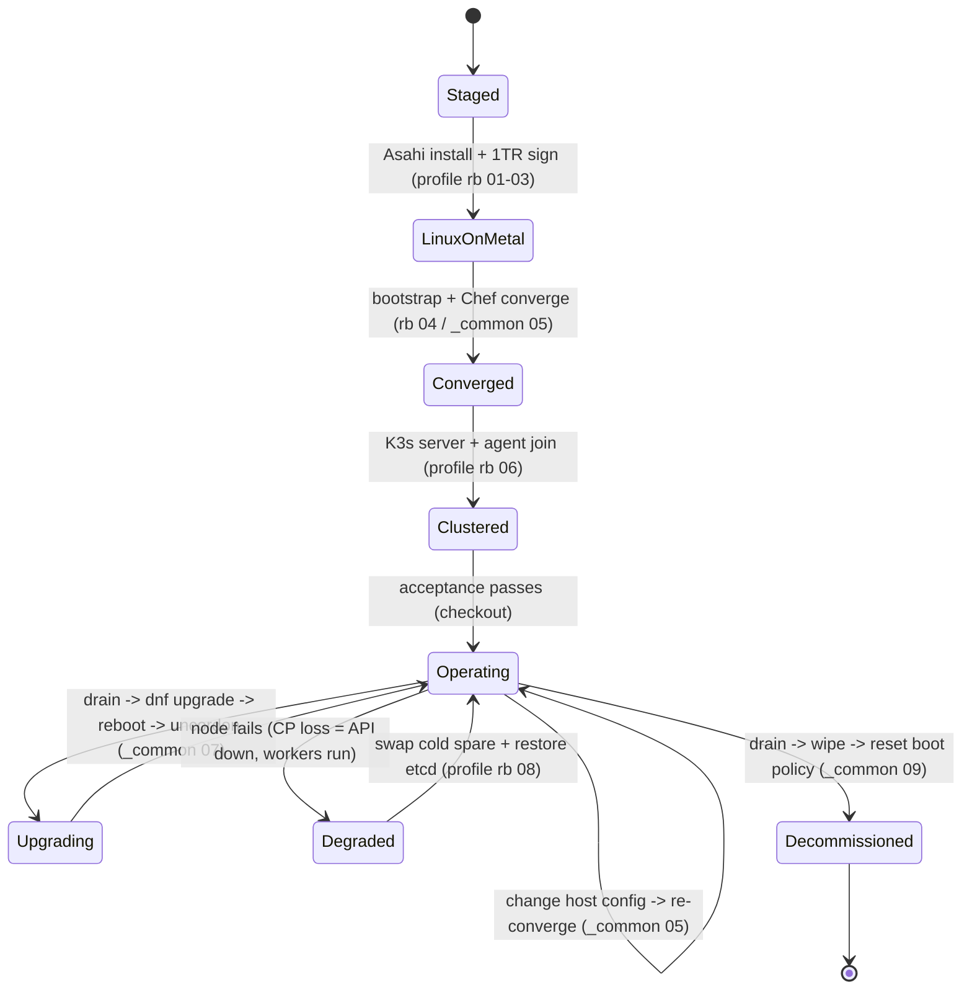

# Apple Silicon → Linux → K3s — Operations & Support

> The full operate-and-support picture, not just install. The README's Lifecycle section is the map;
> this is the territory. The [runbooks](runbooks/README.md) are the *procedures*; this doc is the
> *operating model* — when to run them, who owns what, and how you know the cluster is healthy.

The lifecycle, as a state machine:

<!-- START_GENERATED:docs/diagrams/src/lifecycle.mermaid -->

<!-- END_GENERATED:docs/diagrams/src/lifecycle.mermaid -->

---

## Day-0 — Provision (stand it up)

What must exist before workloads land: **bare-metal Linux on each node** (the manual staging gate —
[profile rb 01–03](runbooks/profile-bare-metal-asahi)), a **converged host** (network, default-deny
firewall, key-only SSH, kernel pin, time — [_common rb 05](runbooks/_common/05-host-converge/RUNBOOK.md)),
and the **K3s substrate** (control plane on `node-1`, workers joined —
[profile rb 06](runbooks/profile-bare-metal-asahi/06-k3s-bringup/RUNBOOK.md)). Exit criterion:
`provisioning/scripts/cluster/00-precheck.sh` is green on every node and the cold spare is staged.

## Day-1 — Deploy (bring the cluster up clean)

First full bring-up and acceptance: K3s server + agents, then
`provisioning/scripts/cluster/99-cluster-checkout.sh` from the operator machine. Exit criterion: all
nodes `Ready`, the default storage class is replicated, no LoadBalancer VIP stuck `<pending>`,
in-cluster DNS answers through its VIP, and the first etcd snapshot has replicated off-node.

## Day-2 — Operate (run it like it matters)

Steady state, where the real cost and risk live. The change loop is split by layer:
- **Host change** → edit the node's attributes / cookbook, re-run `20-converge.sh` (idempotent).
- **Cluster change** → declarative reconcile (manifests), never an out-of-band `kubectl edit` that
  the next reconcile erases.

### Monitoring & Health

| Signal | What it tells you | Source | Alert threshold |
|---|---|---|---|
| Node `Ready` count | a node dropped | `kubectl get nodes` / `00-precheck.sh` | any node `NotReady` > 5m |
| Control-plane API | `node-1` reachable | API health / checkout | API down (workers still serving) |
| etcd snapshot freshness | recovery truth intact | snapshot dir + object-store listing | no new snapshot in 24h |
| Storage replica health | a volume lost a replica | Longhorn status | degraded volume |
| LoadBalancer VIPs | MetalLB announcing | `kubectl get svc -A` | any `<pending>` |
| **Kernel pin intact** | upgrade safety | `grep ^exclude=kernel /etc/dnf/dnf.conf` | pin missing (block upgrades!) |
| Page size | 16K kernel running | `getconf PAGE_SIZE` | ≠ 16384 |
| Time sync | cert validity / etcd health | `chronyc tracking` | not synced |
| Power/console reachability | OOB path alive | PiKVM / PDU | KVM or PDU unreachable |

> **The kernel pin and the snapshot are first-class operational signals here** — the bare-metal
> analogue of watching agent spend. A missing pin is a latent brick; a stale snapshot is an
> un-recoverable control plane. See [COST-MODEL §3 traps](COST-MODEL.md#3-️-operational-cost-traps-read-before-deploying).

### Capacity & Scaling

Scale by **adding a node** (stage → converge → join), not by enlarging one box. Within a node,
capacity is the unified-memory envelope — track it, and grow by joining another secondhand mini
(generations may mix, M1→M4). The host footprint stays <250 MB, so nearly all RAM is workload budget.

### Rolling Upgrades

- **Host OS:** one node at a time — `kubectl drain → dnf upgrade → reboot → kubectl uncordon`
  ([_common rb 07](runbooks/_common/07-rolling-upgrade/RUNBOOK.md)). **Verify the kernel pin first.**
- **Kernel:** never ad-hoc. Wait for the **Asahi project's coordinated release**; the pin blocks
  generic kernels by design.
- **K3s:** bump `INSTALL_K3S_VERSION`, upgrade the **server first**, then workers one by one.

### Backups — etcd + PVC (verified)

- **etcd:** K3s writes daily snapshots (retention 30); a cron on the control plane replicates them
  off-node to an object store.
- **PVC data:** replicated storage gives in-cluster redundancy; back the critical volumes off-node
  too (`object-store://REPLACE_BUCKET/pvc/...`).
- **RPO ≈ 24h** for etcd (tighten with on-change manual snapshots); **RTO ≈ swap + restore time**.
- **A backup nobody has restored is not a backup** — the restore drill ([LLD §9](LLD.md#9-state-snapshots--restore--concrete-commands))
  rebuilds the control plane onto the spare and confirms the cluster comes back.

## Support Model & Break-Fix

| Tier | Scope | Owner | Where |
|---|---|---|---|
| Self-heal | a worker's pods reschedule onto survivors automatically | the orchestrator | — |
| Operator | power-cycle, drain/uncordon, re-converge, **cold-spare swap**, etcd restore | you / platform eng | [profile rb 08](runbooks/profile-bare-metal-asahi/08-cold-spare-and-break-fix/RUNBOOK.md) |
| Escalation | hardware bench diagnosis (no warranty), Asahi upstream bugs | bench / Asahi project | upstream issue tracker |

- **On-call posture:** realistic for a small edge fleet — best-effort/business-hours. The data plane
  keeps forwarding through a control-plane outage; only the API and scheduling are degraded
  ([HLD R1](HLD.md#13-risks--open-questions)).
- **No vendor RMA.** Secondhand hardware has no warranty — the **cold spare is the support contract**.
  Replacement is a swap, bench diagnosis happens off the critical path.
- **Known failure modes → response:** mirror the [LLD failure-modes table](LLD.md#10-failure-modes--recovery);
  every row points at a runbook.

## Day-N — Decommission (retire cleanly)

`kubectl drain` → `kubectl delete node` → stop K3s → boot to 1TR macOS Recovery → **reset the
Secure Enclave boot policy** (`bputil`) → delete the Linux partitions → reclaim the disk → **delete
the node's off-node snapshots/backups**. Then archive the repo at a `decommission/<date>` tag.
**Leaving no orphaned node identity, off-node backup, or boot policy behind is part of the job.** The
orphan checklist and verification are in [_common rb 09](runbooks/_common/09-decommission/RUNBOOK.md).
